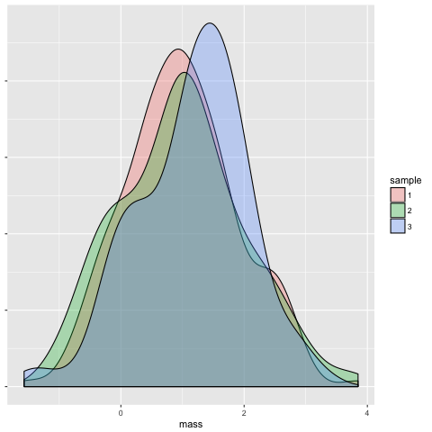

---
# Please do not edit this file directly; it is auto generated.
# Instead, please edit 02-better-design.md in _episodes_rmd/
title: Why we need better design
teaching: 0
exercises: 0
questions:
- "?"
- "?"
objectives:
- ""
- ""
keypoints:
- "Good study design is efficient and can lead to meaningful results."
- "Good study design anticipates analysis of the experiment."
- "Poor study design can lead to waste and insignificant results."

source: Rmd
---

## Why experiments need to be designed
We design experiments to help answer questions by comparing the outcome of different treatments. We can design experiments such that bias and error in the comparison of different treatments is minimized. We control experiments so that we can make stronger inferences about the nature of the differences that we see. Specifically, we try to make inferences about causation.  

The design of a study suggests its analysis. Knowing how a design can be analyzed is critical before embarking on experimentation.

> To consult the statistician after an experiment is finished is often merely to ask him to
> conduct a post mortem examination. He can perhaps say what the experiment died of.
> — Sir Ronald Fisher
{: .quotation}

Analysis can always be re-worked or re-done; the original study however, would be costly and difficult to repeat if done badly. In statistics there is no "magic bullet", or statistical test, that can correct every poorly designed study. The statistical test and the analysis must be determined in the planning stages of an experiment.

## Costs of poor design
Scientific research advances when scientists can corroborate others' results instead of pursuing false leads. Too often, though, published studies can't be reproduced or replicated, and the self-correcting nature of science falters. Some of these problems are entirely preventable through thoughtful and well-informed study design. 

### Time and money
According to [Chalmers and Glasziou](https://www.thelancet.com/journals/lancet/article/PIIS0140673609603299/fulltext?rss=yes), more than 85% of the dollars invested in research are lost annually to avoidable problems. Poorly designed studies are responsible for some of this waste. Given limited research funding it is imperative that experimental design, study quality, and reproducibility be prioritized so that research findings help to build stable and reliable scientific knowledge. 

### Ethical considerations
In animal studies, poor design often uses too many animals and is wasteful, or uses too few animals to obtain meaningful results. Poorly designed preclinical trials can lead to clinical trials involving humans with a shaky foundation of research findings. This is related to statistical power and inadequate sample sizes.

## Experimental design and statistics

## Why good design matters
Good experimental design seeks to balance statistical power, generalizability of findings, validity, practicality, and cost. It should be noted that improving one of the aforementioned often denigrates one or more of the others. For example, decreasing the cost of experimentation often negatively affects statistical power and validity.

### Random variation
Random variation, also called "noise", centers around the mean and has consistent dispersion. Random variation or noise reflects imprecision, but not inaccuracy. Larger sample sizes reduce this imprecision. Pictured below are mass measurements for three different samples. The mean mass for measurements of each sample equals 1. 

Systematic error or bias, in contrast, does not center around the mean. Larger sample sizes don't affect or correct for systematic bias. As an example, a bathroom scale might be calibrated so that measurements are consistently too high or too low. 

### Confounding factors

> ## Discussion
> Think about the following questions and perhaps jot down some notes. Pair up with a
> partner discuss, then share your responses on the etherpad.
> 1). How do you balance statistical power with generalizability, validity, practicality, and cost?
> What have you had to sacrifice in order to find a balance?  
> 2). How can good experimental design help you to save money and time? How can it help your experiment to be reproducible?  
> 3). What are some ethical considerations of good experimental design?
>
{: .challenge}

