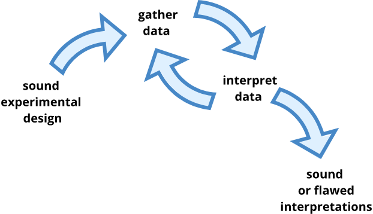

---
# Please do not edit this file directly; it is auto generated.
# Instead, please edit 02-better-design.md in _episodes_rmd/
title: Why we need better design
teaching: 20
exercises: 10
questions:
- "Why does good experimental design matter?"
- "What are some of the features of good experimental design?"
objectives:
- "Provide examples of the positive effects of well designed experiments."
- "Explain the concept of random variation and how it is central to experimental design."
keypoints:
- "Solid experimental designs reduce both the impact of variability and the need for larger sample sizes."
- "Good study design anticipates analysis of the experiment."
source: Rmd
---

## Why experiments need to be designed
Experimental design has three basic purposes:  

1. to control effects of extraneous variables (those variables not under study).   
1. to reduce variability within treatment groups, making differences in treatment outcomes easier to detect.
1. to provide answers to questions by testing causal hypotheses.

We design experiments to help answer questions by comparing the effects of different treatments or conditions on the response variable, as well as any interactions between treatments. Experimental design can determine which data-gathering strategies will meet goals for sensitivity and specificity, while also minimizing time and resource costs. We can design experiments such that bias and error in the comparison of different treatments is minimized. We control experiments so that we can make stronger inferences about the nature of the differences that we see. Specifically, we try to make inferences about causation.  

> *To consult the statistician after an experiment is finished is often merely to ask him to
> conduct a post mortem examination. He can perhaps say what the experiment died of.*
> — Sir Ronald Fisher
{: .quotation}

An analysis can always be re-worked or re-done. The original study however, would be costly and difficult to repeat if done badly. In statistics there is no "magic bullet", or statistical test, that can correct every poorly designed study. 

We can visualize the foundational steps in experimentation as design, data gathering, and interpretation.

If we start with a sound experimental design, we can end up with sound interpretations as one alternative, or with flawed ones as another. If we start with a flawed design, however, we can only end up with flawed interpretations. We could consult a statistician for help, and she could perhaps tell us what the experiment died of. There would be no way of fixing the problem short of re-designing and re-doing the experiment.

The design of a study governs its analysis. Knowing how a design can be analyzed is critical before embarking on experimentation. It's important to forecast possible outcomes from an experiment, and to consider how each outcome will be interpreted. The statistical test and the analysis must be determined in the planning stages of an experiment. Thoughtful planning and design gives us the greatest chance to produce meaningful and robust evidence.

## Why good design matters
Good experimental design seeks to balance statistical power, generalizability of findings, validity, practicality, and cost. It should be noted that improving one of the aforementioned often denigrates one or more of the others. For example, decreasing the cost of experimentation often negatively affects statistical power and validity.

### Random variation
Random variation, also called random error or "noise", exists in the measurement process. Ideally if something is measured many times, each measurement will give exactly the same result and will represent the true value. Random variation centers around the mean and has a consistent dispersion. It reflects imprecision, but not inaccuracy. Larger sample sizes reduce this imprecision. 

For example, the mass of one kilogram is defined by the International Prototype Kilogram, a cylinder composed of platinum and iridium. Copies of this prototype kilogram are distributed worldwide and are regularly compared to the prototype to ensure the standard of a kilogram. None of the copies of the prototype measure precisely the same despite careful storage and handling. The reasons for this variation in measurements is not known. 

Systematic error or bias, in contrast, does not center around the mean. Larger sample sizes don't affect or correct for systematic bias. As an example, a bathroom scale might be calibrated so that measurements are consistently too high or too low. 

> ## Discussion
> Think about the following questions and perhaps jot down some notes. Pair up with a
> partner discuss, then share your responses on the etherpad.  
> 1). How do you balance statistical power with generalizability, validity, practicality, and cost?
> What have you had to sacrifice in order to find a balance?  
> 2). How can good experimental design help you to save money and time? How can it help your experiment to be reproducible?  
> 3). What are some ethical considerations of good experimental design?
>
{: .challenge}

> ## Discussion
> Watch [A Biologist Talks to a Statistician](https://www.youtube.com/watch?v=Hz1fyhVOjr4) (3:33).  
> 1). Why do the two find it difficult to communicate with one another?  
> 2). Which of the two do you empathize or identify with the most?  
> 
{: .challenge}

